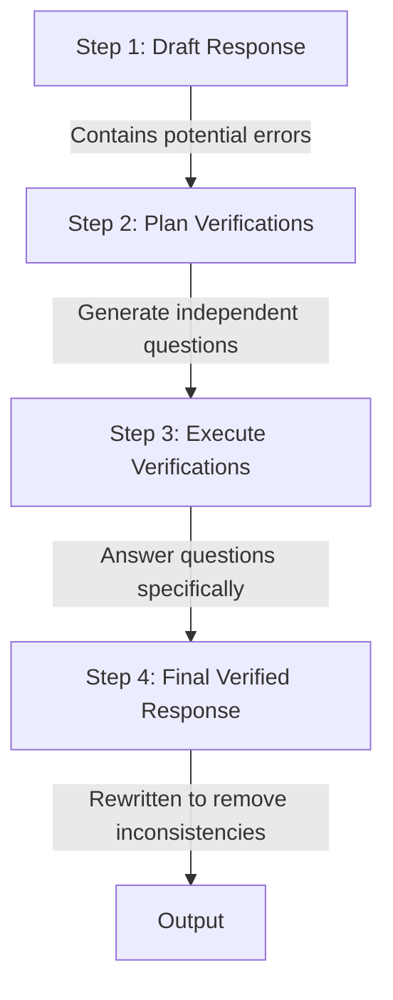

# **📘 Study Guide: Chain-of-Verification (CoVe)**

**Research Paper (by Meta AI)** 👉 : [Chain-of-Verification Reduces Hallucination in Large Language Models ](https://arxiv.org/pdf/2309.11495)

   

## 📖 Overview
This repository contains a detailed **Study Guide** based on the research paper *"Chain-of-Verification Reduces Hallucination in Large Language Models"*. 

As LLMs (like GPT-4, Llama 3, etc.) become central to software development, understanding how to mitigate hallucinations is critical—especially for building reliable **Agentic AI systems**. This guide breaks down the mechanics of "Exposure Bias," the "Snowball Effect," and the specific "Factored" architecture proposed by the researchers to verify facts before generation.

## 🚀 Key Concepts Covered
* **Hallucination Mechanics:** Why models lie and the "Snowball Effect."
* **The CoVe Pipeline:** A 4-step process (Draft -> Plan -> Execute -> Revise).
* **Architectural Comparisons:** Why "Joint" methods fail and "Factored" methods succeed.
* **Diagrams:** Visualizations of the verification flow (Mermaid.js).

## 🛠️ Usage
This guide is intended for:
1.  **Students:** Understanding the theoretical failure modes of LLMs.
2.  **AI Engineers:** Implementing verification loops in LangChain/LangGraph agents.
3.  **Researchers:** Quick reference for CoVe benchmarks and methodologies.

---

## **🏛️ Chapter 1: The Core Problem (Hallucination Mechanics)**

### **1.1 The Definition & The "Tail" Issue**

LLMs frequently hallucinate. While scaling parameters helps general accuracy, it fails to solve errors in **"Tail Distribution Facts"**—facts that appear rarely in training data.

### **1.2 The Plausibility Trap 🎭**

When models fail, they don't output gibberish. They generate **plausible alternatives**.

* *Example:* Naming a similar-sounding but incorrect entity.  
* *Danger:* This makes errors extremely difficult for humans to detect.

### **1.3 Exposure Bias: The "Snowball Effect" ❄️**

In longform generation, one error triggers a cascade of failures.

**❄️ The "Snowball" Analogy**

Think of it like telling a lie. If the model accidentally claims *"The Great War of Alaska started in 1998"* (**The First Error**), it cannot suddenly correct itself. To remain consistent, it must invent details about who fought and who won (**The Snowball**).

**Technical Reality:** The model prioritizes *consistency* with its previous tokens over *accuracy*.

### **1.4 The Paradox of Instruction Tuning**

**Surprising Finding:** Instruction-tuned models (e.g., Llama 2 Chat) often hallucinate *more* than base models on factual retrieval.

* **Why?** Tuning adds "fluff" (extraneous content).  
* **Chain-of-Thought (CoT):** Great for math/logic, but often fails at pure fact retrieval.

## **🛠️ Chapter 2: The Solution – CoVe Pipeline**

The core hypothesis: *The model knows the truth internally, but the generation method (greedy decoding) obscures it.* CoVe forces "deliberation."

### **2.2 The 4-Step Pipeline Architecture**

1. **Generate Baseline:** The initial (likely flawed) draft.  
2. **Plan Verifications:** The model looks at its own draft and asks: *"What facts here need checking?"*  
   * *Example:* Draft says "US annexed Texas in 1845." → Model asks "When did US annex Texas?"  
3. **Execute Verifications:** Answering those specific questions (See Chapter 3).  
4. **Final Response:** Cross-referencing the Draft vs. Verification Answers to produce the final text.

### **2.3 Key Insight: Trivia vs. Storyteller**

**"Independent verification questions provide more accurate facts than longform answers."**

* **Baseline Accuracy:** **\~17%** (Longform generation)  
* **Verification Accuracy:** **\~70%** (Specific questions on same facts)

## **⚙️ Chapter 3: Execution Architectures (The "How")**

This is the most critical technical section. How you architect the prompts determines success.

### **3.1 Variations Tested**

| Method | Mechanism | Verdict | Why? |
| :---- | :---- | :---- | :---- |
| **1\. Joint Method** | Plan & Execute in 1 prompt. | ❌ **Fail** | Model "attends" to its own hallucinations in the draft. |
| **2\. Two-Step** | Separate prompts for Plan vs Execute. | ⚠️ **Better** | Reduces copying errors, but still some leakage. |
| **3\. Factored** | Every question answered in isolation. | ✅ **Good** | Removes "interference" from other context. |
| **4\. Factor \+ Revise** | Adds "Cross-Check" reasoning step. | 🏆 **Best** | Explicitly labels facts as CONSISTENT or INCONSISTENT. |

### **3.2 The "Witness Isolation" Analogy 🕵️‍♂️**

* **The Joint Method (Bad):** Like letting a witness hear the suspect's story before testifying. They change their story to match the suspect (*Context Bias*).  
* **The Factored Method (Good):** Like separating witnesses into **soundproof rooms**. When asked *"What color was the car?"*, they cannot hear the others and must rely on their own memory. **This yields the truth.**

## **🧠 Chapter 4: Psychological Quirks (Sycophancy)**

### **4.1 The "Yes-Man" Behavior**

Models are trained to be helpful, so they exhibit **Sycophancy**: They tend to agree with the user's premise, even if it's wrong.

### **4.2 The "Yes/No" Failure Mode**

Leading questions destroy verification accuracy.

| Query Style | Prompt Example | Model Response | Verdict |
| :---- | :---- | :---- | :---- |
| **Leading (Bad)** | "Was JFK Jr born in Boston?" | "Yes, he was born in Boston..." | ❌ **Hallucination** |
| **Open (Good)** | "Where was JFK Jr born?" | "...born in Washington, D.C." | ✅ **Factually Correct** |

## **📊 Chapter 5: Results & Benchmarks**

### **5.1 Quantitative Success**

* **Wikidata (Lists):** CoVe (Factored) **doubled precision** (0.17 → 0.36).  
* **Biographies:** Improved FACTSCORE by **28%** (55.9 → 71.4).

### **5.2 CoVe vs. The World**

* **vs. ChatGPT:** CoVe (71.4) beat ChatGPT (58.7).  
* **vs. Perplexity.ai:** CoVe beat Perplexity on "Head" and "Torso" facts using *only* internal weights.  
  * *Caveat:* Perplexity (Web Retrieval) still wins on **"Very Rare" (Tail)** facts where the LLM simply has zero knowledge.

## 🔮 Chapter 6: Extended Analysis & Future**

### **6.1 Why "RAG" isn't a Silver Bullet**

Even with web search, systems fail due to:

1. **Vector Loss:** "Lossy compression" during embedding destroys specific details (like Legal/GST codes).  
2. **Chunking:** Splitting a document can separate a "Rule" from its "Condition."  
3. **Garbage In:** SEO spam and outdated forums confuse the model.

### **6.2 The Future: System 2 Thinking**

* **Inference-Time Compute:** Models like **OpenAI o1** use internal chains (similar to CoVe) to critique logic *before* outputting.  
* **Long Context:** Models like Gemini 3 Pro (~1M context) reduces the need for chunking, allowing the model to "read" the whole book.

### **⚠️ Summary of Limitations**

* **Cost:** CoVe is expensive. It multiplies token usage by generating verification questions.  
* **Knowledge Boundary:** You cannot verify what you do not know. If the fact isn't in the weights, CoVe cannot magically find it.

